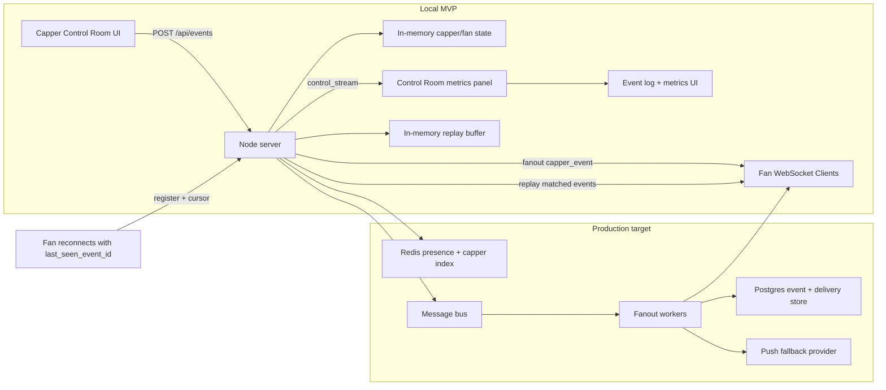

# Dub Club Realtime Notifications

Staff-level system design challenge MVP for a sports creator platform.

## What this proves

- Capper actions are **targeted by follow graph** and delivered only to matching fan sockets.
- Real-time system health is visible with active connections, sent/delivered counts, average latency, and p95.
- MVP reliability primitives are in place: heartbeat, replay window, and idempotent acknowledgement handling.

## How to run

- `npm install`
- `npm run dev`
- `npm run test:smoke`

## Why this project exists

This is a demo-first implementation of a capper workflow used by sports creators:
- new picks
- odds movement alerts
- game start reminders
- result updates
- reward notifications
- live notes

The repository includes working code plus the design story so a reviewer can evaluate both correctness and scale direction in minutes.

## One-screen architecture (local + production path)

## Demo flow

- [Demonstration script (90 sec)](docs/DEMO_SCRIPT.md)
- [Load testing notes](docs/LOAD_TESTING.md)
- [System design write-up](docs/SYSTEM_DESIGN.md)
- [Submission note](docs/SUBMISSION_NOTE.md)

## Core features

- Two seeded cappers: SharpSide Sam, Courtside Kelly
- Six seeded fans with different follow combinations
- Capper Control Room, simulated fan clients, live event stream, and metrics
- Replay on reconnect with event id cursor and dedupe on acknowledgements
- Load test and smoke test scripts for repeatable validation

## Scripts

- `npm run dev` starts backend and frontend
- `npm run load:test` runs configurable local load simulation
- `npm run load:test:small`
- `npm run load:test:medium`
- `npm run test:smoke`
- `npm run typecheck`
- `npm run build`

## What to check during review

- Confirm only follower fans receive events
- Confirm metrics move during sends
- Confirm smoke and small load checks are clean
- Confirm docs show local scope and production mapping

## Known MVP boundary

This stage is intentionally in-memory and intentionally local. It demonstrates architecture behavior before introducing Redis, gateway sharding, durable replay, and mobile push fallback for full production scale.
