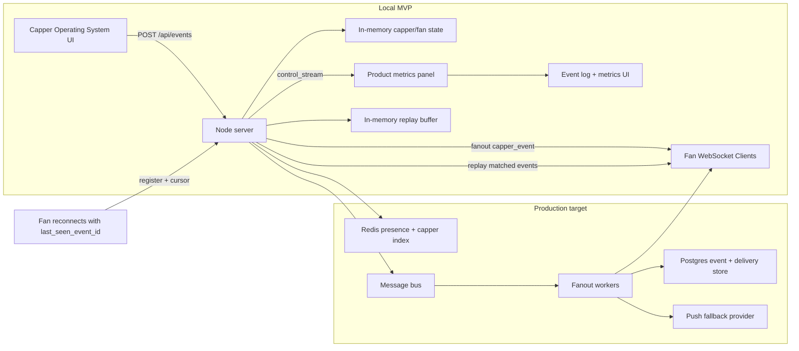

# DubClub Capper-Fan Realtime Demo

Staff Software Engineer (Full-Stack) submission for DubClub's sports creator platform.

[](https://github.com/developwithJB/dubclub-realtime-notifications/actions/workflows/ci.yml)

## Reviewer quick path

If you only have a few minutes:

1. Run `npm install && npm run dev`.
2. Open `http://localhost:5173`.
3. In **Capper Operating System**, click `Post New Pick` or `Odds Moved`.
4. Confirm only the fans who follow that capper receive the notification.
5. Click `Tail Pick` and `Open` on a fan notification.
6. Watch the metrics update: follower targets, online fan targets, sessions, delivered fans, replay, duplicate acks, offline pending, average latency, and p95.
7. Run `npm run test:smoke`, then `npm run load:test:small`.

For the React Native signal:

```bash
cd mobile
npm install
npx tsc --noEmit
npm run ios
```

The mobile prototype is intentionally fan-facing: alerts, ledger, tailing, rewards/results, reconnect cursor, deep links, capper record, pick lifecycle, and responsible-play context.

## What this proves

- Capper actions are **targeted by follow graph** and delivered only to matching fan sockets.
- Fans can act on product notifications by tailing picks, reviewing odds movement, opening pick deep links, and seeing result/reward context.
- Real-time system health separates followers, online fan targets, active sessions, delivered fans, replay sends, duplicate acks, offline pending, average latency, and p95.
- MVP reliability primitives are in place: heartbeat, replay window, multi-session fan sockets, publish idempotency, request-size protection, and idempotent acknowledgement handling.
- Notifications carry DubClub-specific trust context: capper record, pick lifecycle, result ledger hints, reward context, and responsible-play copy.

## Why this is specific to DubClub's role

The attached job description frames DubClub's product problem clearly: sports betting content is fragmented, trust is fragile, and fans need a smoother way to tail cappers while cappers need a business-building operating system. This repo reflects that:

- **Capper OS:** publish urgent picks, odds movement, results, rewards, and live notes with audience, channel, urgency, and business-goal metadata.
- **Fan trust loop:** keep record context, pick lifecycle, result ledger, rewards, and responsible-play copy next to the fan's decision.
- **Delivery health:** show whether the business audience, live socket path, replay path, and idempotency path are actually working.
- **Mobile-first product thinking:** the Expo prototype is a fan inbox and ledger, not a dashboard squeezed onto a phone.
- **Staff IC execution:** the code and docs show end-to-end ownership, technical judgment, speed with maintainability, and a path from local MVP to production scale.

## Role description alignment

This is rooted in the attached **Staff Software Engineer (Full-Stack)** job description:

- **Senior IC ownership:** the repo includes working product code, backend fanout logic, React web UI, React Native mobile prototype, validation scripts, Docker/CI artifacts, and production architecture notes.
- **Founders and GTM partnership:** the demo is framed around user value and roadmap tradeoffs, not only infrastructure; it shows how capper moments become fan actions, retention loops, trust context, and rewards.
- **Mobile and web product features:** the web app demonstrates the capper/fan realtime loop, while `mobile/` demonstrates a focused ReactNative-style fan inbox with alerts, ledger, tailing, reconnect cursor, and deep links.
- **Speed, scope, and maintainability:** the implementation stays intentionally local and inspectable, while documenting the production path to Django/Go APIs, PostgreSQL delivery records, Redis presence/follower indexes, and push fallback.
- **AI-first engineering:** the docs call out agent-assisted iteration as a workflow advantage while keeping validation concrete through typecheck, build, smoke, and load scripts.
- **Sports betting context:** the product copy and data model use cappers, odds movement, picks, results, rewards, tailing, and trust/ledger context because those are the workflows DubClub describes.

## How to run

- `npm install`
- `npm run dev`
- open `http://localhost:5173`
- `npm run test:smoke`
- `npm run load:test:small`
- optional mobile prototype: `cd mobile && npm install && npm run ios`

`npm run dev` starts two local processes:

- `server/` on `http://localhost:4000`, which owns the WebSocket fanout, HTTP event API, seeded cappers/fans, metrics, acknowledgements, and in-memory event log.
- `client/` on `http://localhost:5173`, which renders the capper-fan demo and six simulated fan clients.

## Why this project exists

This is a demo-first implementation of a capper workflow used by sports creators:
- new picks
- odds movement alerts
- game start reminders
- result updates
- reward notifications
- live notes
- fan-side tailing and pick deep links

The repository includes working code plus the design story so a reviewer can evaluate both correctness and scale direction in minutes.

## Staff Engineer Readout

This submission intentionally treats the assignment as a Staff Software Engineer product architecture problem, not just a WebSocket exercise.

- **Product insight:** DubClub's hard problem is reducing fragmented, low-trust capper workflows into a unified fan and creator loop. The app models cappers publishing time-sensitive picks, odds movement, results, rewards, and live notes while fans can tail, inspect trust context, and open deep links.
- **Architecture tradeoff:** the MVP stays local and in-memory so it is fast to review, but it preserves the right seams: event API, fanout gateway, follow index, replay buffer, idempotency, acknowledgement metrics, and mobile push/deep-link path.
- **Production mapping:** the same boundary maps to Django/Go APIs, Redis presence and follower indexes, Postgres event/delivery tables, event bus fanout workers, and mobile push fallback.
- **Risk posture:** auth, payments, compliance workflows, moderation, durable replay, and real responsible-gaming enforcement are explicitly stubbed here, not ignored.

## Validation

The final pass was validated with:

```bash
npm run typecheck
npm run build
npm run test:smoke
npm run load:test:small
npm run load:test:medium
cd mobile && npx tsc --noEmit
```

The load scripts count only event IDs published during the current run, so replay-buffer events from prior runs cannot make delivery look healthier than it is.

## What you are seeing on screen

The web app is a single-page realtime capper-fan demo. It shows the capper-side operating system, product lenses, a live fan inbox simulation, delivery metrics, trust context, and notification/event logs in one view.

### Header

The top of the screen shows the demo name, server status, and the latest metrics update time. `Server: online` means the React client has an active control WebSocket connection to the Node backend.

### Live metrics

The metric cards summarize current realtime health:

- `Active connections`: the control stream socket plus the active simulated fan sockets.
- `Follower targets`: recent intended audience size by follow graph.
- `Online fan targets` and `Online sessions`: unique live fans versus active devices/sessions.
- `Unique sends` and `Unique delivered`: fan-level delivery attempts and acknowledgements.
- `Offline pending`, `Replay sends`, and `Duplicate acks ignored`: operational reliability counters.
- `Average latency` and `P95 latency`: acknowledgement latency from send to fan ack.
- `Last event type`: the latest capper action sent.

### Capper Operating System

This section is the sender side of the product. Choose an active capper, then click one of the action buttons:

- `Post New Pick`
- `Odds Moved`
- `Game Starting Soon`
- `Result Posted`
- `Reward Unlocked`
- `Live Capper Note`

Each button posts a templated event to `POST /api/events` with `audience_segment`, `delivery_channels`, `business_goal`, and `idempotency_key`. The server looks up which fans follow that capper, sends the event only to online matching fans over WebSocket, tracks offline pending fans, and updates the metrics and event log.

### Simulated Fan Clients

Each fan card is a separate simulated WebSocket client. The seeded fans intentionally follow different cappers:

- Ava follows SharpSide Sam.
- Ben follows Courtside Kelly.
- Cara follows both cappers.
- Drew follows SharpSide Sam.
- Emma follows no one.
- Finn follows Courtside Kelly.

When SharpSide Sam sends an event, only Ava, Cara, and Drew should receive it. When Courtside Kelly sends an event, only Ben, Cara, and Finn should receive it. Emma should stay empty because she follows no capper.

Fan cards show connection status, followed cappers, latest latency, tailed pick count, trust context, and the latest notification inbox items. Pick notifications include a `Tail Pick` action. After clicking it, that fan's card changes the button to `Tailed` and increments `Tailed picks`.

### Deep links

Some notifications include an `Open` link. Clicking `Open` changes the URL, for example to `/mobile/picks/live-brunson-over`, and opens an in-app detail panel at the top of the dashboard. This is intentionally handled without a full page reload, so the live dashboard state remains intact. The detail panel shows the notification body, market, line, odds, confidence/result/reward context, and a `Back` button to return to `/`.

### Live Event Stream

The event stream is the operational table for recent capper events. It shows:

- short event id
- event type
- capper
- business goal
- follower count
- online fan/session count
- delivered and pending count
- replay and duplicate ack count
- latest latency
- notification title

For a successful SharpSide Sam event, expect three follower fans and three online fan targets in the default dashboard. Courtside Kelly has the same shape. Emma remains empty because she follows no capper.

### Architecture Summary

This section restates the local architecture in product terms: React product demo, Node + `ws` backend, in-memory fan presence/follow state, publish idempotency, capper action fanout, fan acknowledgements, metrics, and event logging.

### Notification Event Log

The event log gives a longer audit-style list of notifications with full event ids, creation time, and delivery timestamp. It mirrors the backend's in-memory event log.

## How the app works

1. On load, the client fetches `GET /api/state` for seeded cappers, fans, current metrics, and the event log.
2. The dashboard opens one control WebSocket and registers with `{ role: "control" }`.
3. Each simulated fan card opens its own WebSocket and registers with `{ role: "fan", fan_id }`.
4. Clicking a capper action posts an event to `POST /api/events`.
5. The server validates known capper IDs, applies the event metadata, computes recipients from the fan follow graph, and sends `capper_event` messages only to matching connected fans.
6. Fan clients render the inbox item and send an `ack` back to the server.
7. The server records delivery, latency, and acknowledgement state, then broadcasts updated metrics and event logs to the product demo.
8. Deep links are handled client-side with `history.pushState`, so opening a pick/reward detail does not reset inbox or tail-pick state.

## Role alignment

DubClub's production stack is Django/Go, PostgreSQL, TypeScript/Svelte, React Native, Docker, GitHub Actions, and Terraform. This demo uses Node + TypeScript for evaluator speed and a tiny setup footprint, while the production notes map the same boundaries to a Go or Django API, Postgres durability, and a sharded gateway/fanout path. The `mobile/` folder adds a focused Expo/React Native fan inbox prototype because this role explicitly values mobile product judgment.

## One-screen architecture (local + production path)



## Demo flow

- [Demonstration script (90 sec)](docs/DEMO_SCRIPT.md)
- [Load testing notes](docs/LOAD_TESTING.md)
- [System design write-up](docs/SYSTEM_DESIGN.md)
- [Submission note](docs/SUBMISSION_NOTE.md)

## Core features

- Two seeded cappers: SharpSide Sam, Courtside Kelly
- Six seeded fans with different follow combinations
- Capper Operating System, product lenses, simulated fan clients, tail-pick action, live event stream, and metrics
- Lightweight trust layer with capper record, pick lifecycle, result ledger, reward, and responsible-play context
- Replay on reconnect with event id cursor and dedupe on acknowledgements
- Publish idempotency, request-size cap, and known capper/follow validation
- Load test and smoke test scripts for repeatable validation, including replay and duplicate ack checks
- Optional Expo mobile prototype with reconnect state, trust context, tailing, rewards/results, and pick deep links

## Scripts

- `npm run dev` starts backend and frontend
- `npm run load:test` runs configurable local load simulation
- `npm run load:test:small`
- `npm run load:test:medium`
- `npm run test:smoke`
- `npm run typecheck`
- `npm run build`

## What to check during review

- Confirm only follower fans receive events
- Confirm metrics move across follower/online/session/delivery/replay counters
- Confirm smoke, small load, and medium load checks are clean
- Confirm docs show local scope and production mapping

## Known MVP boundary

This stage is intentionally in-memory and intentionally local. It demonstrates architecture behavior before introducing Redis, gateway sharding, durable replay, and mobile push fallback for full production scale.
